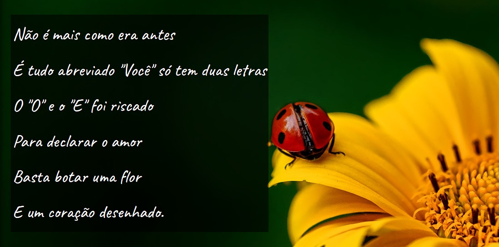

# Projeto Redes Sociais



O Projeto Cordel é uma proposta feita pelo professor Gustavo Guanabara para seus alunos. Nele, eu apresento uma página com um breve cordel do autor Milton Duarte.

## Índice

- [Visão Geral](#visão-geral)
- [Funcionalidades](#funcionalidades)
- [Tecnologias Utilizadas](#tecnologias-utilizadas)
- [Instalação](#instalação)
- [Estrutura do Projeto](#estrutura-do-projeto)
- [Contribuição](#contribuição)
- [Licença](#licença)
- [Contato](#contato)

## Visão Geral

A página web desse projeto contém um cordel, e a proposta feita era de aperfeiçoar as técnicas usando o Efeito Parallax e deixar o site visualmente agradável e responsivo utilizando HTML e CSS.
 
## Funcionalidades

- **Navegação fluída**: Os componenetes utilizados contribuem para uma navegação mais leve.
- **Design Responsivo**: A página é responsiva e se adapta a diferentes tamanhos de tela.

## Tecnologias Utilizadas

- **HTML**: Estrutura da página.
- **CSS**: Estilização da página.

## Instalação

Para rodar este projeto localmente, siga os passos abaixo:

1. Clone o repositório:
   ```bash
   git clone https://github.com/ajborgesdev/projeto-cordel.git
   ```
2. Navegue até o diretório do projeto:
   ```bash
   cd projeto-cordel
   ```
3. Abra o arquivo `index.html` no seu navegador:
   ```bash
   open index.html
   ```

## Estrutura do Projeto

```
projeto-social/
├── estilo/
│   └── style.css
├── imagens/
│   ├── apresentacao-projetocordell.jpg
│   ├── background001.jpg
│   └── background002.jpg
├── cordel-moderno.txt
├── index.html
├── LICENSE
└── README.md
```

## Contribuição

Contribuições são bem-vindas! Siga os passos abaixo para contribuir:

1. Faça um fork do projeto.
2. Crie uma branch para sua feature (`git checkout -b feature/NovaFeature`).
3. Commit suas mudanças (`git commit -m 'Adiciona nova feature'`).
4. Faça push para a branch (`git push origin feature/NovaFeature`).
5. Abra um Pull Request.

## Licença

Este projeto está licenciado sob a Licença MIT - veja o arquivo [LICENSE](LICENSE) para mais detalhes.

## Contato

- **Ana Julia Borges** - [anajborges03@gmail.com](mailto:anajborges03@gmail.com)
- **GitHub** - [ajborgesdev](https://github.com/ajborgesdev)
- **LinkedIn** - [Ana Julia Borges](https://www.linkedin.com/in/ajborgesdev/)